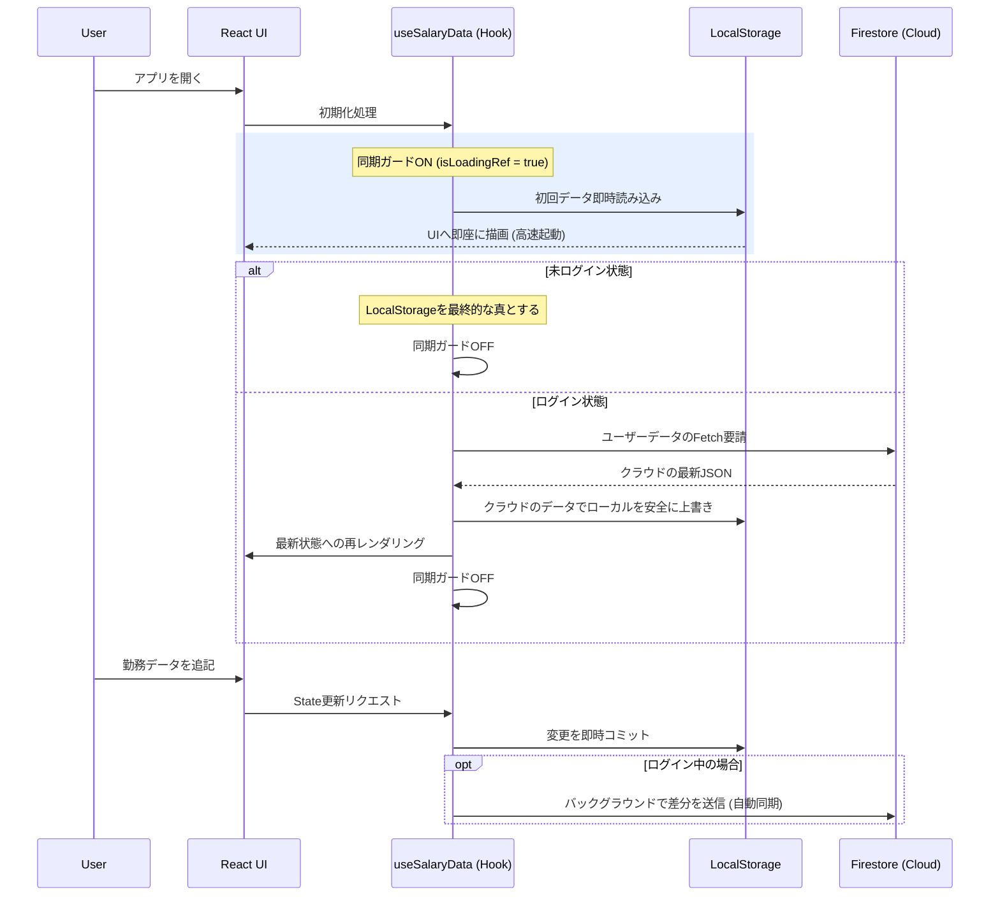

# Juku Salary App 💰 - 公式テクニカル・ドファレンス

塾講師特有の非常に複雑な給与計算をフロントエンドで劇的に効率化し、さらにゲーミフィケーション要素（XP、レベル、バッジシステム）により日々のモチベーションを高めるための、オフラインファースト Web アプリケーションです。

本ドキュメントは、このプロジェクトのソースコードを読み解き、将来的な運用・保守・拡張を行うすべての開発者に向けた**包括的なテクニカル・マニュアル（全8章）**です。ソースコード内にも JSDoc やインラインコメントが豊富に記載されていますが、システムの全貌や「なぜそのように設計されたのか（Why）」はこのドキュメントに集約されています。

---

## 📑 目次構成 (Table of Contents)

- [Chapter 1: 序章と設計思想](#chapter-1-序章と設計思想-introduction--philosophy)
- [Chapter 2: システムアーキテクチャ](#chapter-2-システムアーキテクチャ-system-architecture)
- [Chapter 3: データベース設計とスキーマ](#chapter-3-データベース設計とスキーマ-database--schema)
- [Chapter 4: コア・ビジネスロジック詳解](#chapter-4-コアビジネスロジック詳解-business-logic-deep-dive)
- [Chapter 5: ゲーミフィケーションエンジン](#chapter-5-ゲーミフィケーションエンジン-gamification-system)
- [Chapter 6: アプリケーションの構成とコンポーネント](#chapter-6-アプリケーションの構成とコンポーネント-component-architecture)
- [Chapter 7: カスタムフックと状態管理](#chapter-7-カスタムフックと状態管理-state-management)
- [Chapter 8: 開発・運用ガイド](#chapter-8-開発運用ガイド-operations--development-guide)

---

## Chapter 1: 序章と設計思想 (Introduction & Philosophy)

### 1.1 背景と解決する課題
塾講師の給与形態には独特な複雑さがあります。例えば、授業（コマ）ごとの時給換算、役職に応じたコマ単価の変動、他校舎へのヘルプ出勤に伴う時給の微細な調整、そして分単位での事務給（生徒対応、コマ間の休憩など）の計算です。これらを手書きや汎用スプレッドシートで管理することは人間にとって大きな認知負荷となります。
この課題を根本から解決するため、あらゆる条件と独自の計算ルールをフロントエンドのロジックとしてカプセル化し、入力と同時に瞬時に給与見込み（源泉徴収税込み）を可視化する専用ツールとして本アプリは誕生しました。

### 1.2 「オフラインファースト」へのこだわり
地下鉄の移動中や、通信環境の安定しない塾のバックヤードなどでも「ストレスゼロ」で操作できること。それが本アプリの最大のUX要件です。
そのために、すべての操作（勤務入力、設定変更）は**まずブラウザの LocalStorage に同期的に保存され、UI が瞬時に応答**するように設計されています。Firebase へのデータ同期は、後からバックグラウンドで（ネットワークが復帰したタイミングで）静かに実行されます。

### 1.3 ゲーミフィケーションによるモチベーション管理
ただの給与計算ツールで終わらせないため、労働を「冒険」に見立てる仕組みを導入しました。働けば働くほど、稼げば稼ぐほど「経験値（XP）」が溜まり、ルーキーから殿堂入りまで「レベル」と「称号」が上がっていきます。また、特定の条件（連勤など）を満たすと「バッジ」が自動アンロックされる仕組みを持ち、働く意欲を底上げする設計哲学が貫かれています。

---

## Chapter 2: システムアーキテクチャ (System Architecture)

### 2.1 技術スタック
本アプリケーションはモダンなWebフロントエンド技術で構築されており、バックエンド（サーバー）を自前で持たない Serverless アーキテクチャ構成です。

- **Frontend Core**: React 18, TypeScript, Vite
- **Global State**: React Context API, Custom Hooks
- **Persistence (Local)**: Window.localStorage
- **Backend as a Service (BaaS)**: Firebase (Authentication, Firestore)
- **Deployment & Hosting**: Vercel
- **UI & Styling**: Vanilla CSS (CSS Modules的アプローチ), Lucide React (Icons), Recharts (グラフ描画)

### 2.2 クラウドとローカルの双方向同期の仕組み
本アプリにおける「Source of Truth（真実の情報源）」は、ユーザーの認証状態によって動的に切り替わります。



### 2.3 レースコンディション対策 (`isLoadingRef` の戦略)
Reactの `useEffect` は非同期であり、複数の副作用が同時に走ると、予期せぬタイミングで「空の初期State」がLocalStorageを上書きしてしまい、ユーザーデータが消失するリスクがあります。
本アプリでは `src/hooks/useSalaryData.ts` の中で、`useRef` を用いた **同期的ロードガード (`isLoadingRef`)** を導入しています。クラウドデータが降ってくるまで、一切の「保存アクション」をブロックし、データ破壊から完全にシステムを防御しています。

---

## Chapter 3: データベース設計とスキーマ (Database & Schema)

### 3.1 Firestoreのデータモデル
Firestoreには `users` コレクションが1つだけ存在し、ドキュメントIDとして Firebase Auth の `uid` を使用するフラットな設計です。各ユーザードキュメントは巨大なJSONオブジェクトとして格納されます。
サブコレクションは使用せず、単一ドキュメント内に全てを収めることで、1回のリード/ライトで全体の同期が完了する高速性を重視しています。

```javascript
// Firestore /users/{uid} のスキーマ
{
  "entries": {         // 毎日の勤務データ。キーは日付文字列(YYYY-MM-DD)
    "2026-04-14": {
      "id": "uuid-string",
      "date": "2026-04-14",
      "selectedBlocks": ["A", "B", "C"], // 勤務したコマ
      "leaderBlocks": ["A"],             // リーダー役職で勤務したコマ
      "supportMinutes": 30,              // 追加の事務給時間（手動入力分）
      "campus": "新札幌",                // 出勤した校舎
      "hasTransport": true,              // 交通費支給の有無
      // その他設定オーバーライド項目...
    }
  },
  "config": {          // ユーザーのグローバル設定およびプロフィール情報
    "teachingHourlyRate": 1380,
    "hourlyRate": 1075,
    "defaultCampus": "平岡",
    "profile": {
      "name": "ユーザー名",
      "activeTitle": "star_teacher",
      "unlockedTitles": ["rookie", "star_teacher"],
      // バッジ等のステータス...
    }
  },
  "updatedAt": "2026-04-14T10:00:00Z"
}
```

### 3.2 未ログインからログインへのデータ移行戦略
ユーザーはアカウントを作成せずとも、一時的なLocalStorage環境でフル機能を利用できます。もしアプリを気に入り、途中からアカウント登録（ログイン）を行った場合、`useAuth` フックがそれを検知し、ローカルに蓄積していた `entries` と `config` を丸ごとFirestoreへ初回送信（マイグレーション）します。これによって、ユーザーにシームレスな体験を提供します。

---

## Chapter 4: コア・ビジネスロジック詳解 (Business Logic Deep-Dive)

システムの心臓部である給与計算エンジンは `src/utils/calculator.ts` に純粋関数として集約されており、引数として「1日の勤務データ (`entry`)」と「ユーザー設定 (`settings`)」を受け取り、その日の給与合計（税抜額）を正確に弾き出します。

### 4.1 授業給与の計算（基本と役職）
1つのコマ（A〜Gなど）は90分間として規定されており、「時給 × 1.5時間」で算出します。
- **通常コマ**: 設定における `teachingHourlyRate` × 1.5
- **役職（サブリーダー）**: コマが `subLeaderBlocks` に含まれる場合、固定単価の 1500円 × 1.5 で計算
- **役職（リーダー）**: コマが `leaderBlocks` に含まれる場合、固定単価の 2000円 × 1.5 で計算し、全ての時給設定を上書き（最優先）します。

### 4.2 ヘルプ手当の増減メカニズム
講師が「所属校舎（デフォルト設定）」とは異なる校舎へ「ヘルプ入試（応援）」へ赴いた場合、特殊な時給補正がかかります。
1. **平岡発・他校舎行き**: 所属が「平岡」で勤務地が「他」の場合、時給が **-100円** 減額。
2. **他校舎発・平岡行き**: 所属が「他」で勤務地が「平岡」の場合、時給が **+100円** 増額。
このルールは基本給与に対して適用された後に、1.5時間倍されます。

### 4.3 事務給（生徒対応・準備給）の自動算出（超精密仕様）
塾システムにおいて最も計算が難解な「事務給」は、ユーザーが手入力する追加対応時間（`supportMinutes`）に加えて、以下の時間を関数が自動的に検知・加算し、最終的に「分換算 → 時間換算 × 事務時給（`hourlyRate`）」として給与化します。

- **コマ内休憩（ルール1）**: 担当したコマ数 × 5分間 を、授業準備・アフターケア時間として無条件に加算します。
- **コマ間休憩（ルール2）**: ブロック順序に基づき、**連続するコマ（例: AとBの両方を担当）を検知すると、その間に10分間の休憩が発生したとみなし加算**します。
- **特定ブロック間例外（ルール3）**: BコマとCコマの間だけは「昼休み」として定義されているため、連続勤務していてもこの10分の休憩加算は免除（+0分）されます。

### 4.4 交通費と勤務地域手当
- **地域手当**: その日、コマか事務給が1分でも発生していれば自動付与されます。「平岡」地区なら800円、それ以外なら400円が一律付与。
- **交通費**: エントリごとに「交通費あり/なし」を手動でトグルでき、有効な場合は設定済みの交通費額（校舎ごとの設定を優先し、なければ基本交通費）を加算します。

---

## Chapter 5: ゲーミフィケーションエンジン (Gamification System)

`src/utils/levelSystem.ts` と `src/utils/badges.ts` が連携し、ユーザーの「労働記録」を「ゲームの冒険の記録」へと昇華させます。

### 5.1 XP（経験値）計算モデル
総 XP は、過去の全累計データを対象とした以下の3要素の合算から導出されます。
1. **給与（Earnings）**: 稼いだ合計金額 100円 につき **1 XP** を付与。
2. **コマ数（Classes）**: 担当した累計コマ数 1コマ につき **50 XP** を付与。
3. **出勤日数（Work Days）**: 実際に労働した累計日数 1日 につき **50 XP** を付与。

### 5.2 レベルデザインと数学的最適化
レベルアップに必要なXP曲線は単純な一次関数ではなく、高レベルになるほど到達が困難になる累乗式を採用しました。
公式: `XP = 14 * (Level - 1)^2.2`

この曲線により、
- Lv 1 -> Lv 2 : 14 XP（すぐに上がる快感）
- Lv 10: 約2,200 XP
- Lv 50: 約76,000 XP
- Lv 70（最終目標・殿堂入り）: 約150,000 XP（数年単位の労働でのみ到達可能）
といった、長期的なやり込み要素を提供しています。

### 5.3 称号アンロックシステム
レベル到達に応じて自動的に称号（Title）が解禁され、プロフィール上で名乗ることができます。
Lv.10 で「ルーキー」、Lv.40 で「オールスター」、そして最高レベル Lv.70 で「殿堂入り（Hall of Famer）」へと自動進化します。解禁状況は `useEffect` によって監視されており、条件を満たした瞬間にプロフィール設定が更新され、新バッジフラグが立ちます。

### 5.4 バッジシステムとアチーブメントの検知
`getStreakBadges` 関数は、配列化された日付の「連続性」を数学的に計算し、`diff === 1`（1日差）が一定日数続いた場合に「連勤王（Tier: Gold, Silver, Bronze）」のようなバッジを発行します。これらのバッジもすべてローカルストレージの計算で解決され、クラウドへの負荷なしにダイナミックに生成されます。

---

## Chapter 6: アプリケーションの構成とコンポーネント (Component Architecture)

### 6.1 ディレクトリ構造と責務の分離
クリーンアーキテクチャの原則を導入し、React コンポーネントツリーを階層化しています。
```bash
src/
├── components/   # UIパーツ群。ロジックを持たず、Propsでのみ状態を受け取る（Pure志向）
├── contexts/     # 言語(i18n)などのGlobal Context。
├── data/         # ニュース一覧等、変更の少ない静的マスターデータ。
├── hooks/        # UIと分離されたビジネスロジック (Custom Hooks)。
├── layouts/      # 画面のシェル（ナビゲーションバー配置領域）。
├── lib/          # 状態を持たないサードパーティ初期化コード（Firebase設定）。
├── locales/      # 多言語翻訳ファイル（ja.ts, en.ts, es.ts）。
├── pages/        # Router対応予定の画面のエントリーポイント。
├── types/        # 型の安全性と予測可能性を担保する TypeScript Type.
└── utils/        # 最重要。副作用を持たない（API通信しない、Stateを持たない）純粋関数の集約場所。
```

### 6.2 App.tsx のオーケストレーター的役割
`App.tsx` は単なるルートモジュールではなく、**巨大な状態遷移のオーケストレーター**として機能しています。
- 全てのモーダル（Settings, Analytics, WorkEntry, Authenticationなど）の `isOpen` フラグを中央集権的に管理しています。
- 各モーダルや CalendarGrid へは、`useSalaryData` から抽出した `entries` と `settings`、および状態更新のコールバックをPropsのバケツリレーで一挙下達します。

### 6.3 UIデザインへのこだわり (Glassmorphism & Micro-interactions)
UIは、ただの事務ツールに見えないよう、美しいグラデーションや「すりガラス効果（backdrop-filter）」を多用した最新のGlassmorphismデザインを採用しています。ボタンクリック時やモーダル展開時のマイクロアニメーションもCSSにより軽量に実装し、触っていて気持ちのいい操作感を提供します。

---

## Chapter 7: カスタムフックと状態管理 (State Management)

### 7.1 useSalaryData: データアクセスとキャッシュ
本アプリで最も重要なカスタムフックです。コンポーネントが直接 LocalStorage や Firebase に触れることを禁止し、全てのリクエストはこのフックを介して行われます。
- `updateEntry(date, data)`: 提供された差分をマージ。もしデータが空（すべて0）になった場合は、オブジェクト自体からキーを削除してクリーンナップを行います。
- `updateSettings(config)`: 設定を更新すると即座にLocalStorageに保存し、「同期ガード」に関わらずクラウドへ強制再送信を行うことで即時反映を確約します。

### 7.2 useLanguage & i18n
多言語対応は、外部ライブラリ（react-i18next等）を使わずに、軽量で高度に最適化された独自の Context API （`LanguageContext.tsx`）で実装されています。アプリ全体はキー駆動（例：`t('app.title')`）でレンダリングされ、ブラウザの言語設定を初回検知して自動的に「日本語・英語・スペイン語」を切り替えます。

---

## Chapter 8: 開発・運用ガイド (Operations & Development Guide)

### 8.1 ローカル環境開発手順
```bash
# プロジェクトのクローン
git clone https://github.com/HarutoJAZZ45/juku-salary-app.git
cd juku-salary-app

# 依存関係のクリーンインストール
npm ci

# `.env.local` ファイルを作成し、Firebaseの認証情報をセット（構成は別紙参照）

# Vite開発サーバーを起動 (Fast Refresh 有効)
npm run dev
```

### 8.2 ビルドとCI/CD (Vercel)
本プロジェクトのデプロイは GitHub の `main` ブランチにプッシュされた際、Vercel の Webhooks を通じて**完全自動**で行われます。
デプロイ前には必ず以下のビルドステップを通過します。
```bash
# TypeScriptの型検査を厳格に実行してから、ViteのRollupビルドを実行
npm run build
```
ビルドは通常15秒程度で完了し、全世界のCDNエッジへ配信されます。Vercel上の設定で、環境変数 (`VITE_FIREBASE_API_KEY` 等) が正しく設定されていることを確認してください。

### 8.3 拡張ガイドライン
- **新しい称号やバッジの追加**: `src/utils/levelSystem.ts` の `TITLES` 配列にルールを追加するだけで、表示から判定まで自動対応します。UI側への変更は不要です。
- **新しい計算ルールの追加**: `src/utils/calculator.ts` のテストしやすい純粋関数内に組み込んでください。その際、引数の追加が必要な場合は `src/types/index.ts` の型定義も同時に拡張し、型安全の保証を維持してください。
- **翻訳テキストの修正**: UI文言を変更する場合は直接 `.tsx` に書かず、必ず `src/locales/` 配下の指定言語ファイルマップを更新してください。

---
*Document Version: 2.0.0 | Generated securely reflecting off-line first, gamified architecture principles.*
